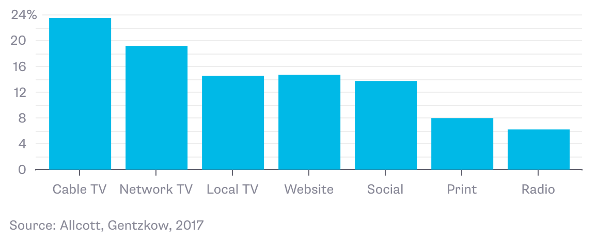

#  Problem 0
Used Wickham's Style Guide. 

***
***

#  Problem 1
In terms of the pane layout, I stuck with the default settings because I have been used to using these settings every since I have been using R. My source is its own window on the top left, console is its own window on the bottom left, and the help and git on the bottom right, and everything else at the top right. I also followed the other suggestions such as changing the font and background to Tomorrow Night.

***
***

#  Problem 2
a.


<div style="width:300px">

</div>

b. The graph addresses the answers to a question from a survey by Bloomberg: "Which of these sources was your most important source of news and information about the 2016 election?" Several options such websites, radio, and Cable TV were included. 

The x-axis of the graph is the type of primary news source for the     election, while the y-axis is the percentage of responses for each source. 

The main result of the graph is that 23.5% of respondents say that their most important news source for the 2016 election is Cable TV, which is higher than any other source including websites and social media. Radio had the lowest response, with only 6.2%. 

c. The graph does a pretty good job of achieving its goals, as it clearly compares the popularity of different news sources for the 2016 election. The graph does not use an unecessary amount of data ink, as its results are very easily readable, and the overall graph is simple. The graph does not distort the actual effect of the relationship, as comparing the heights of the bars are accurately represent their actual response porportion.

Some stregnths of the graph are that its very simple and easy to read. The weaknesses are that the graph does not contain enough labels, particularly it is missing a y-axis and a title. For this graphic, I would add a y-axis label such as "% of respondent's primary 2016 election news source" and a title such as "What Are The Most Popular 2016 Election News Sources?."  

d. The graph does not contain any surrounding text besides the source and year. I would include a brief description describing more about how the data was collected or about the types of people that were surveyed to help the viewer understand the graphic.

***
***

#  Problem 3
a.  
```{r}
# Quadratic function given four parameters
quadratic <- function(a, b, c, x) {
  return(a * (x ** 2) + b * x + c)
}
```

b.  
```{r}
# Testing out the quadratic function on three different combinations of parameters
quadratic(1, 2, 3, 4)
quadratic(33, 1, 10, 5)
quadratic(5, 6, 9, 10)
```

c.  
```{r}
# Running quadratic only passing in a value for the x parameter 
# quadratic(x=2)
```

This line results in an error because there are other parameters that are unspecified, so the function does not know what to return. 

d. 
```{r}
# Create a quadratic2 function containing default values for parameters
quadratic2 <- function(a = 1, b = 1, c = 1, x) {
  return(a * (x ** 2) + b * x + c)
}
quadratic2(x = 2)
```

When you specify only one argument the function returns an integer because it resorts to the default values for the other parameter values. 

e. Typing 1:10 at the command line prints a list with all integers from 1 to 10. 

f.
```{r}
# Running quadratic2 passing in a list for x 
quadratic2(x = 1:10)
```

The result you get is a list of numbers, since x is a list and the function computes the expression on all values of the list x and returns the result. 

g.  
```{r}
plot(1:10, quadratic2(x = 1:10))
```

In the graph, we see that the values of y increase as the x increases, and the shape of the line is parabolic. The y values of all the points are always positive, starting at close to zero when x = 1 and ending at over 100 when x is 10. 

***
***

#  Problem 4
a.
```{r}
library(tidyverse)
```

b. The gg in ggplot2 stands for "grammar of graphics." 

c. The authors of ggplot2 are Hadley Wickham, Winston Chang, and Rstudio. The maintainer is Hadley Wickham. Some of the other R packages that he has written include dplyr, tidyr, and stringr. 

d.  
```{r}
library(MASS)
data(Cars93)
head(Cars93)
ncol(Cars93)
colnames(Cars93)
```

This dataset contains 27 columns, whose names are:

"Manufacturer", "Model", "Type", "Min.Price", "Price", "Max.Price", "MPG.city", "MPG.highway", "AirBags", DriveTrain", "Cylinders", "EngineSize", "Horsepower", "RPM", "Rev.per.mile", "Man.trans.avail", "Fuel.tank.capacity", "Passengers", "Length", "Wheelbase", "Width", "Turn.circle", "Rear.seat.room", "Luggage.room", "Weight", "Origin", "Make"

e.
```{r, warning = FALSE, message = FALSE}
library(tidyverse)
library(MASS)
data(Cars93)

#  First graph
ggplot(data = Cars93) + 
  geom_bar(aes(x = Type), fill = "darkblue", color = "black") +
  labs (
    title = "Car Type Popularity Bar Chart",
    x = "Car Type",
    y = "Number of Cars"
  )

#  Second graph
ggplot(data = Cars93) + 
  geom_histogram(aes(x = MPG.city), fill = "orange", color = "black")

#  Third graph
ggplot(data = Cars93) + 
  geom_point(aes(x = Fuel.tank.capacity, y = MPG.highway, color = Type))

#  Fourth graph
ggplot(data = Cars93) + 
  geom_text(aes(x = Fuel.tank.capacity, y = MPG.city, 
                label = Type, color = Origin)) +
  labs (
    title = "Tank Capacity vs. City MPG",
    x = "Capacity (US Gallons)",
    y = "City MPG",
    subtitle = "Additional variables include the car type and origin (USA or not)",
    caption = "Source: Lock, R. H. (1993) 1993 New Car Data. Journal of Statistics Education 1(1)."
  )
```

From the fourth graph, we can see that small and sporty cars tend to have higher city MPGs but also have smaller tank capactities than vans, midsize, and large cars. The graph does not give any evidence of cars from the USA having significantly higher city MPGs or capacities than non-USA cars. Small cars seem to have the highest city MPGs, with the highest at over 40 MPG while vans have the largest tank capacities, with the largest at over 25 gallon tank capacity. 

***
***


#  Problem 5
a. Enrolled in Piazza already. 

b. Changed settings to real time.

c. I certify that I understand that I am responsible for reading and understanding all material and content posted on the course Piazza page.

d. I certify that I will not abuse the use of anonymous posting on the course Piazza page.

***
***

#  Problem 6

Yes. 
